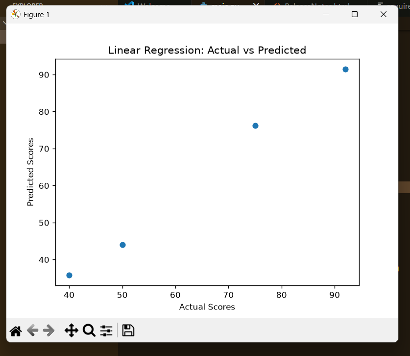

# Student Performance Prediction (ML Project)

## Overview
This project predicts student final scores based on:
- Study Time
- Absences

## Models Used
- Linear Regression
- Decision Tree Regressor

## Evaluation
Models are evaluated using R² Score.

## Results
Both models achieved high accuracy (~0.96 R² score).

## Visualization

Scatter plot comparing actual vs predicted scores.

## Tech Stack
- Python
- Pandas
- Scikit-learn
- Matplotlib
